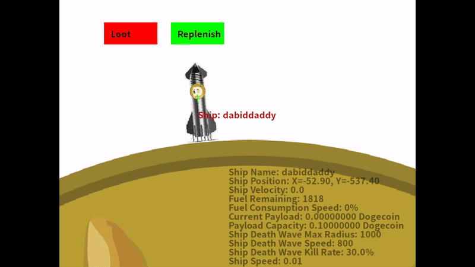
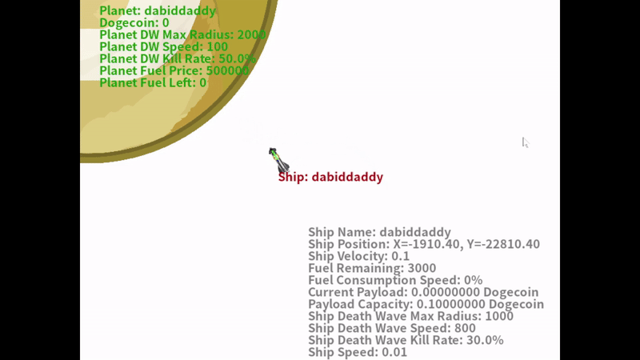

# Doge-Space-Exploration
Doge Space Exploration is a multiplayer online game. Players can earn dogecoin by looting planets. 

# Requirements
Following modules are needed to run the game:
1.socket
2.json
3.pygame
4.math
5.tkinter
6.qrcode
7.PIL
8.sys
9.threading
10.os

# How The Game Works
"The Doge" is a planet in the center of game. The dogecoin of "The Doge" is displayed in the game. "The Doge" is like a cash pool for players to loot. The spaceship of the player is created near their home planet. The home planets of players are created with a distance to "The Doge" planet according to normal distribution. The players need to control their spaceships to loot dogecoin from other planets. When a player loots a planet, the planet will emit a death wave, which is deadly towards any ships. The spaceships controled by the players can also emit death wave but with shorter radius. When a spaceship with dogecoin payload gets destroyed by a death wave, the dogecoin will be automatically transferred to the spaceship/planet that kills the spaceship. Regarding the landing, the spaceship can only successfully land by landing vertically with its head up and velocity below crash threshold.

# Loot and Death Wave

# Rotate, Crash and Respawn

# Earn and withdraw Dogecoin

# In Game Support
Contact @Dabiddaddy on Twitter for support.

# Support The Game
If you want to support the game, you can directly donate to "The Doge" planet with dogecoin address: DTZarPkdUdgomAAAUzVm2Kj9LiCojshi6A

# Support The Developer
if you want the game getting updated with new features, you can support the developer with following dogecoin address: DNVy3sSpAfL5Q2Xf2CojTkKUgBeXx1zEp6

